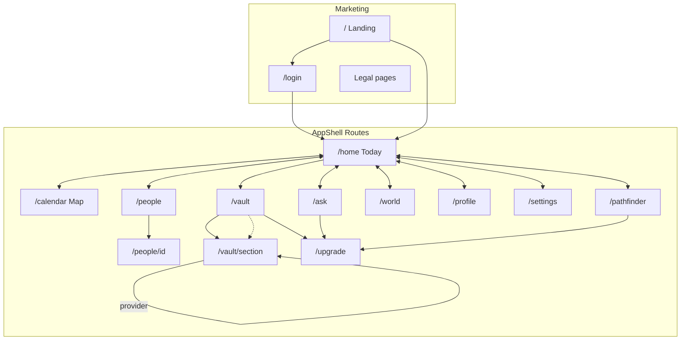

# Navigation Map

Entry points, exit points, and active navigation states. Observations only.

---

## Navigation Models

The application uses **three distinct navigation contexts**:

| Context | Routes | Chrome |
|---------|--------|--------|
| Marketing | `/`, legal pages | `LandingNav` or `LegalPageShell` + footer |
| Authenticated app | `/home`, `/calendar`, `/ask`, `/people`, `/pathfinder`, `/profile`, `/vault`, `/world`, `/settings`, `/upgrade` | `AppShell` (header + sidebar/bottom nav) |
| Standalone | `/login`, `/dashboard` | No app shell |

---

## Primary App Navigation (DEC-0002)

### Mobile — Bottom Nav (5 tabs)

| Tab key | Label (EN) | Route | Icon |
|---------|------------|-------|------|
| `today` | Today | `/home` | Home |
| `ask` | Ask | `/ask` | Question |
| `people` | People | `/people` | People |
| `pathfinder` | Pathfinder | `/pathfinder` | Compass/map |
| `profile` | Profile | `/profile` | User |

**Not in mobile bottom nav:** Map/Calendar, World, Settings, Vault, Upgrade

### Desktop — Sidebar (8 items)

| Key | Label (EN) | Route |
|-----|------------|-------|
| `today` | Today | `/home` |
| `map` | Map | `/calendar` |
| `ask` | Ask | `/ask` |
| `people` | People | `/people` |
| `pathfinder` | Pathfinder | `/pathfinder` |
| `world` | World | `/world` |
| `profile` | Profile | `/profile` |
| `settings` | Settings | `/settings` |

### Header Actions (both breakpoints)

| Element | Route / action |
|---------|----------------|
| Brand logo | `/home` |
| Vault pill | `/vault` |
| Tier badge | `/upgrade` |
| Language chips | In-page lang switch (no route change) |

---

## Landing Navigation

| Link | Target |
|------|--------|
| Logo | `/` (top) |
| Trust | `#trust` |
| How It Works | `#how` |
| Features | `#features` |
| Start Free | `/login` or `/home` (per CTA wiring) |
| Language | In-page switch |

**Exit points:** `/login`, scroll anchors, footer legal links

---

## Route Entry Matrix

| Screen | Primary entry | Secondary entry |
|--------|---------------|-----------------|
| Landing `/` | Direct URL | — |
| Today `/home` | Bottom nav, post-login | Onboarding completion |
| Calendar `/calendar` | Desktop sidebar Map | Home view pref redirect |
| Ask `/ask` | Bottom nav | — |
| People `/people` | Bottom nav | — |
| Person `/people/[id]` | People list tap | — |
| Vault `/vault` | Header Vault pill | Upgrade CTAs (return) |
| Vault section | Vault grid card | — |
| Profile `/profile` | Bottom nav | Alert CTAs (no profile) |
| Settings `/settings` | Desktop sidebar | `/setting` redirect |
| Upgrade `/upgrade` | Tier badge, Vault, paywalls | Ask Julia card |
| Pathfinder `/pathfinder` | Bottom nav | Desktop sidebar |
| World `/world` | Desktop sidebar only | — |
| Login `/login` | Landing CTA | — |
| Dashboard `/dashboard` | Direct URL only | — |
| Legal | Footer links | — |

---

## Route Exit Matrix

| Screen | Common exits |
|--------|--------------|
| Landing | Login, Home, legal footer |
| Today | All tabs, Profile (alert), Calendar redirect |
| Calendar | Profile, tabs, ICS download (external) |
| Ask | Profile, tabs, back steps |
| People | Person detail, tabs |
| Person detail | People list back |
| Vault | Home, Upgrade, section routes |
| Profile | Tabs, Settings (desktop) |
| Settings | Sidebar routes |
| Upgrade | Back, Contact, Home |
| Pathfinder | Upgrade, Profile, tabs |
| World | Close modals, sidebar routes |
| Login | Home (success redirect) |

---

## Active State Rules

| Location | Active indicator |
|----------|------------------|
| Bottom nav | `aria-current="page"` on active tab link; gold/bright icon + label |
| Desktop sidebar | Active item background + gold left border |
| Header Vault pill | Distinct fill when on `/vault` or child routes |
| Landing nav | Section highlight on scroll intersection |
| Settings | Sidebar highlight when pathname `/settings` |

---

## Breadcrumbs

**No formal breadcrumb component exists.**

Implicit back navigation observed:
- Vault: "← Back to Today"
- Upgrade: back text link
- Ask: "Back" between flow steps
- Person detail: link back to people list
- Vault sections: return via vault index navigation

---

## Deep Links & Redirects

| Path | Behavior |
|------|----------|
| `/setting` | Server redirect → `/settings` |
| `/home` with `calendar` home view pref | Client redirect → `/calendar` |
| Post-login | Redirect → `/home` |
| Disclaimer gate | Blocks interaction until accepted (first visit) |

---

## Conceptual Routes (No Dedicated Screen)

| Concept | Where surfaced |
|---------|----------------|
| **Provider** | `/vault/provider` section card |
| **Julia** | `/upgrade` VIP tier; `/ask` advisor card; vault copy references |
| **Notifications** | `/calendar` export option "App notifications only" — no notification center UI |

---

## Navigation Diagram

---

## Orphan / Legacy Routes

| Route | Nav visibility |
|-------|----------------|
| `/dashboard` | Not linked from AppShell or landing |
| `/dev/chart-test` | Dev only |
| `/contact` | Footer links only |
